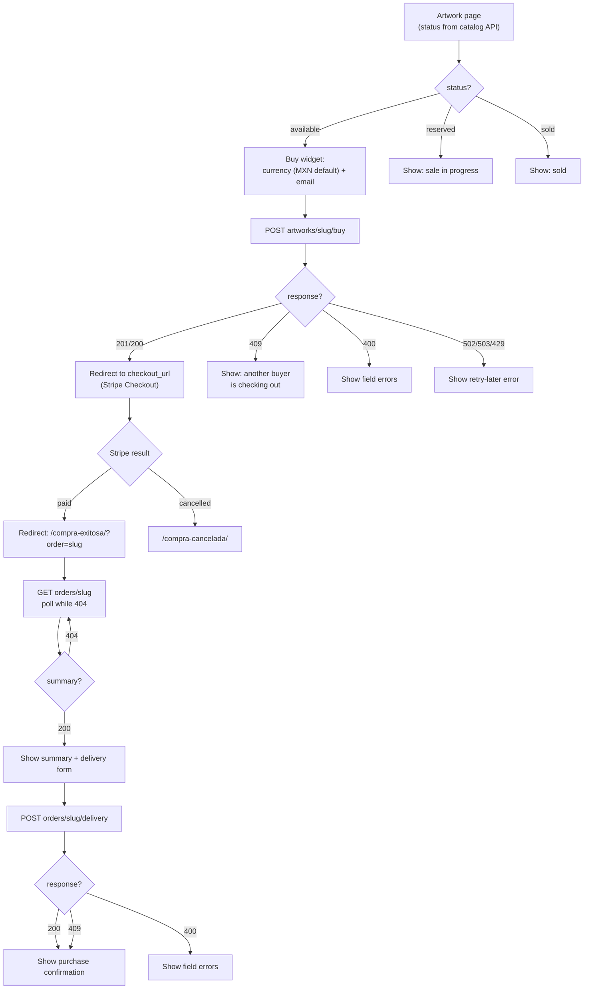
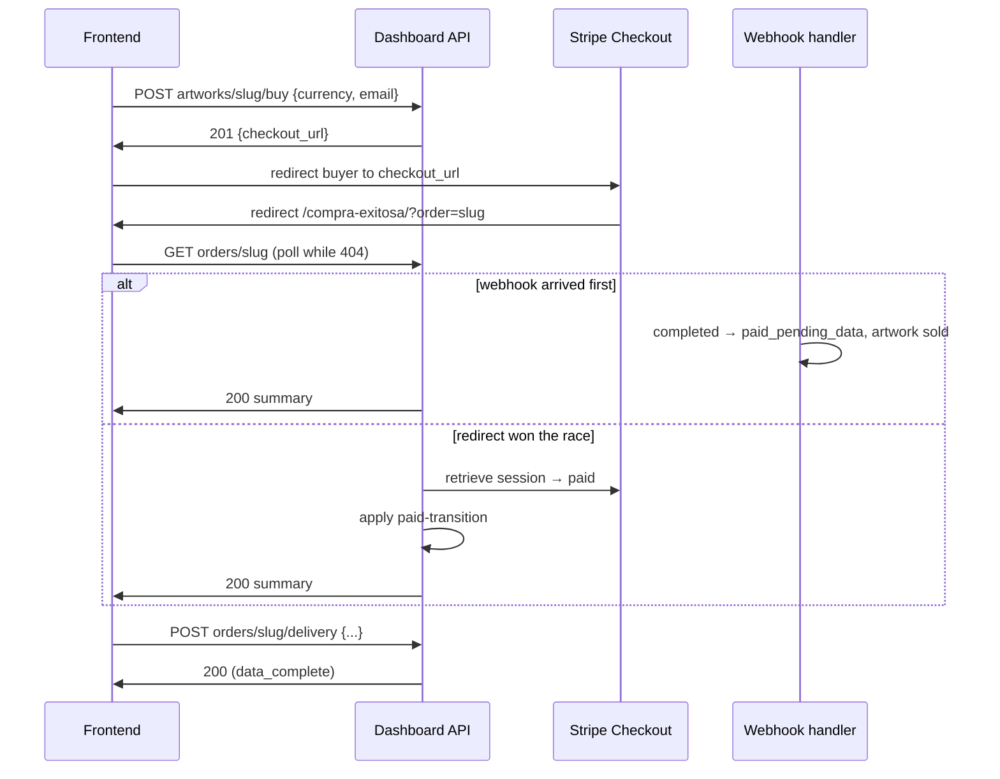
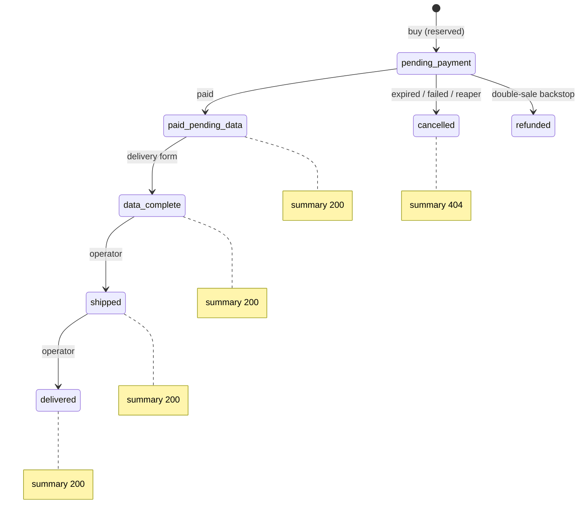

# Artwork Sales (Stripe one-off payments)

End-to-end purchase of unique artworks. Subscriptions live in
`docs/stripe-subscriptions.md`; testing recipe in `docs/testing-stripe.md`.

## Flow

1. Visitor picks currency (`mxn`/`usd`) + email on the buy screen.
2. `POST /api/artworks/artworks/{slug}/buy/` reserves the artwork
   (`available → reserved`), creates an `ArtworkOrder` (`pending_payment`)
   and a `mode=payment` Checkout Session (30-min expiry). Returns
   `{checkout_url}`. Same email + live session → same URL (`200`);
   different email → `409`.
3. Buyer pays in Stripe Checkout (email locked to `customer_email`).
4. `checkout.session.completed` (only when `payment_status == "paid"`) →
   order `paid_pending_data`, artwork `sold`. Async methods (OXXO/SPEI)
   resolve via `checkout.session.async_payment_succeeded` (paid) /
   `async_payment_failed` (cancel + release). Unpaid `completed` = no-op.
5. Frontend redirects to `{PUBLIC_SITE_URL}/compra-exitosa/?order={slug}`.
   `GET /api/artworks/orders/{slug}/` returns the summary. If the redirect
   beats the webhook, the endpoint verifies via `retrieve_checkout_session`
   and applies the paid-transition itself; unpaid → `404` (poll/retry).
6. Buyer posts delivery info:
   `POST /api/artworks/orders/{slug}/delivery/` (only from
   `paid_pending_data` → `data_complete`, else `409`).
7. Operator: **Marcar enviada** (`data_complete → shipped`),
   **Marcar entregada** (`shipped → delivered`),
   **Liberar reserva** (`pending_payment → cancelled` + release).
8. Expiry: `checkout.session.expired` (or async failed) → `cancelled` +
   artwork `available`. Lost webhooks: external cron runs
   `release_expired_orders`; drift: `sync_orders_from_stripe [--dry-run]`.
9. Double-sale backstop: `completed` for an already-sold artwork →
   order `refunded` + automatic Stripe refund (fees not recovered).
   Manual refunds happen in the Stripe Dashboard (out of scope).

## Env vars

- `PUBLIC_SITE_URL` (required): external frontend origin. Missing → buy
  returns `503` before creating anything.
- Existing `STRIPE_*` keys reused; no new webhook endpoint/secret.

## Frontend contract

- Collect `{currency, email}` on the buy screen; consume `{checkout_url}`.
- Host `/compra-exitosa/?order=` (reads query param, polls
  `GET orders/{slug}/` while `404`) and `/compra-cancelada/`.
- Throttles: `artwork_buys 20/hour`, `artwork_orders 60/hour`
  (`REST_FRAMEWORK.DEFAULT_THROTTLE_RATES`).

## Cron

```bash
# every 10 min (external service)
venv/bin/python manage.py release_expired_orders
# hourly drift check (optional)
venv/bin/python manage.py sync_orders_from_stripe
```

## USD note

USD Checkout verified working on the MX-based account (spike 2026-09-17,
see `docs/stripe-account-setup.md`). If Stripe ever rejects a `usd`
session, buy returns `502`, rolls back the reservation, and the frontend
falls back to MXN.

---

## Frontend integration

Base URL: `{DASHBOARD}/api/artworks/` (configurable per environment; the
public site origin must be in the backend's `CORS_ALLOWED_ORIGINS`).
No authentication on sales endpoints (public by design). Throttles:
`artwork_buys 20/hour` (buy), `artwork_orders 60/hour` (summary +
delivery). Error envelope on failures:
`{"status": "error", "message": "...", "data": {...}}`.

### Endpoints

**`POST artworks/{slug}/buy/`** — reserve + start Checkout.
Request: `{"currency": "mxn" | "usd", "email": "<buyer email>"}`.
Success: `201 {"checkout_url": "..."}` (new reservation) or
`200 {"checkout_url": "..."}` (same buyer re-clicked while their session
is live — follow the URL either way).

| Code | Meaning | Proposed UX |
|---|---|---|
| 201/200 | Session ready | Redirect to `checkout_url` (full page) |
| 400 | Bad currency/email (`data` has field errors) | Inline form errors |
| 404 | Unknown slug or inactive artwork | "Obra no disponible" / 404 page |
| 409 | Reserved by another buyer, or not `available` | "Someone is already buying this piece — try again in a few minutes" |
| 502 | Stripe did not respond (nothing reserved) | "Payment service unavailable — try again" |
| 503 | Backend misconfigured (`PUBLIC_SITE_URL`) | Generic error + alert the operator |
| 429 | Throttled | "Too many attempts — wait and retry" |

**`GET orders/{slug}/`** — order summary for the success page.
`200`: `{"slug", "status", "currency", "amount" (number),
"paid_at", "artwork_title", "artwork_image" (url|null),
"artist_name"}` for orders in `paid_pending_data`, `data_complete`,
`shipped`, `delivered`. `404`: unknown slug, `cancelled`/`refunded`, or
still-unpaid `pending_payment` (webhook not arrived yet → poll, see below).

**`POST orders/{slug}/delivery/`** — delivery form. Required:
`receiver_name` (≤200), `receiver_phone` (≤50), `country` (≤100),
`state` (≤100), `city` (≤100), `postal_code` (≤20), `neighborhood`
(≤150, colonia), `street` (≤200), `exterior_number` (≤30). Optional:
`interior_number` (≤30), `between_street_1`/`between_street_2` (≤200),
`reference`, `delivery_notes`. `200` returns the summary (order is now
`data_complete`); `409` if the order is not awaiting delivery data
(e.g. form re-submitted — treat as success and show confirmation);
`400` with field errors.

### Buy workflow



### Payment confirmation sequence



### Order states (frontend-visible)



### Required frontend views

1. **Buy widget** (on the artwork page, only when catalog `status ==
   "available"`): currency selector (MXN pre-selected, USD verified
   working), email input (standard email validation; backend lowercases
   it), submit → redirect to `checkout_url`. Disable the button while the
   request is in flight (double-clicks reuse the same session, but one
   click is cleaner).
2. **`/compra-exitosa/?order={slug}`**: read `order` from the query
   string, poll `GET orders/{slug}/` (proposed: every 3s, up to ~60s;
   stop on `200` or on repeated non-404 errors), render summary
   (`artwork_title`, `artwork_image`, `amount` + `currency`,
   `artist_name`), then show the delivery form. If polling times out,
   show "payment confirming — check your email / try again shortly".
3. **`/compra-cancelada/`**: static page ("purchase cancelled, the piece
   is back on sale if still available") with a link back to the artwork.
4. **Catalog artwork cards**: use catalog `status` — `available` →
   buy button; `reserved` → "sale in progress" badge; `sold` → "sold"
   badge (no button).

### Test checklist (frontend)

- Buy with `mxn` and `usd` → `201` + `checkout_url`.
- Re-click buy with the same email → `200`, same URL.
- Buy with another email while reserved → `409`.
- Summary for a paid order → `200` with all 8 fields.
- Summary for unknown/cancelled order → `404`.
- Delivery with all required fields → `200`; missing field → `400`;
  second submit → `409` (treat as success).
- Throttle: exceed 20 buys/hour → `429` (handle like retry-later).

## Follow-ups (remaining validations & tasks)

1. **Bruno `Sales/` collection — done.** `bruno/collections/enredarte-dashboard-api/Sales/`
   holds `POST buy.bru` (seq 23), `GET order-summary.bru` (seq 24),
   `POST order-delivery.bru` (seq 25), each with a mandatory `docs`
   block per `openspec/specs/bruno-request-docs/spec.md` (public
   endpoints: no `Authorization` header, throttles documented instead),
   example artwork slug for buy (`obra-ejemplo`) and fake-hex order slugs
   with a "copy the slug from the Stripe redirect" note (buy returns only
   `{checkout_url}`, so slug chaining is impossible). `bruno/README.md`
   carries the `Sales/` section plus the credential-free smoke command
   (`bru run Sales/`, delivery manual-only).
2. **Staging concurrent-buy race — accepted as-is.** The
   `select_for_update` guard is proven by sequential tests only; a true
   concurrent run on Postgres was waived by the operator (see design D4
   note). Revisit if gallery traffic ever grows beyond a few buys/day.
3. **Manual refunds stay in the Stripe Dashboard** (operator decision,
   out of scope) — no dashboard refund action planned.
